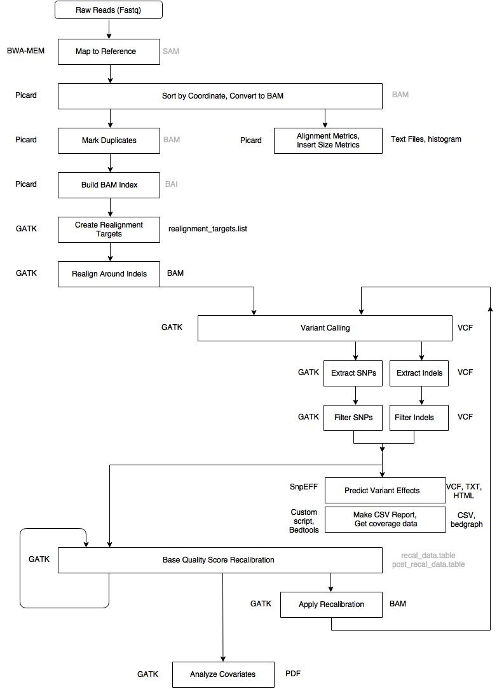

## Large-Scale Exome Sequencing Study Implicates Both Developmental and Functional Changes in the Neurobiology of Autism

### Hypothesis
Rare inherited and de novo variants are major contributors to individual risk for autism spectrum disorder.  
When such rare variation disrupts a gene in individuals with ASD more often than expected by chance, it implicates that gene in risk

### Findings
102 genes implicated in risk for autism spectrum disorder (ASD genes, FDR % 0.1)

Most are expressed and enriched early in excitatory and inhibitory neuronal lineages

Most affect synapses or regulate other genes; how these roles dovetail is unknown

Some ASD genes alter early development broadly, others appear more specific to AS

### SAMPLE INFO
Total Number of Exome Samples: **35584**  
Exome Samples Autism spectrum Disorder: **11986**  
                                        

### Data source and Tools

### The pipeline used for variant calling 

- Sequencing reads were aligned to human genome build 37 (GRCh37/hg19) using the Burrows-Wheeler Aligner, aggregated into a BAM file.  

- Picard was used for sorting by chromosome coordinates and marking duplicates.   

- Single nucleotide variants (SNVs) and insertions / deletions (indels) were jointly called across all samples using the Genome Analysis Toolkit HaplotypeCaller package version 3.4.   

- Variant call accuracy was estimated using the GATK Variant Quality Score Recalibration (VQSR) approach.

### Downstream Analysis

## QUANTIFICATION AND STATISTICAL ANALYSIS

1. The VCF file, containing approximately 29,000 exomes, was loaded into Hail 0.1 to perform basic quality control steps
2. Annotated with Variant Effector Predictor

Hail is a library in python developed by broad institute which is consists of functionality for processing genetic data which requires structed tabular or matrix data.   [Link](https://hail.is/docs/0.2/overview/index.html)

### Round 1, sample-level quality control

1. To check the accuracy of the reported pedigree information, relatedness was calculated between each pair of samples using Hail’s ibd() functionbr
  
2. Sex was imputed for each sample using Hail’s impute_sex() function.
  
3. The relatedness values were input into the program PRIMUS (**Pedigree Reconstruction and Identification of a Maximum Unrelated Set**) which inferred pedigree structure. Combined with the imputed sex, these inferred pedigrees were compared to reported pedigrees and checked for compatibility.
  
4. Obvious errors in reporting were fixed (e.g., swapped mother/father or parent/child labels in the same family), and samples with a discrepancy that could not be resolved **(200) were dropped**
  
5. Parents without a child in the dataset **(250) were also dropped**, resulting in 28,547 samples and 5,420,608 unique variants.

### Round 1, variant-level quality control

1. Low-complexity regions were removed (110,963 variants), as were SNVs that failed VQSR (265,130 variants)

2. For genotype quality control, filtered calls with a depth between 10 to 1,000

3. For homozygous reference calls, we filtered genotypes with less than 90% of the read depth supporting the reference allele or with a genotype quality less than 25

4. For homozygous variant calls, we filtered genotypes with less than 90% of the read depth supporting the alternate allele or with a Phred-scaled likelihood (PL) of being homozygous reference less than 25

5. Filtered any heterozygous call in the X or Y non-pseudoautosomal regions in a sample that imputed as male.

6. For samples imputed as female, calls from the Y chromosome were removed.

7. After applying these filters, the dataset contained 28,547 samples and 4,755,048 unique variants

### Round 2, sample-level quality control

- Removed samples with estimated contamination levels using **FREEMIX** -- 20 samples were removed

- Removed samples with **chimeric reads** -- 121 samples samples were removed

- Stratifying samples into 18 different batches (by exome capture/year/cohort/sequencing center)

- Samples were filtered if their call rate was greater than 3 standard deviations below the group mean -- 300 samples removed.

- Duplicate samples were then removed -- 761 samples removed

- Samples for which the imputed sex did not match the reported sex -- 59 samples removed.

### Reevaluation 

Based on the above sample filters, family structures were reevaluated:

- if one or more parents of a case in the **family-based data** (‘‘proband’’) had been filtered

- the proband was reclassified as a case in the **case-control data** and the remaining parent (if any) was dropped

- if the proband had an unaffected sibling, the sibling was kept as a **‘‘sibling of case’’** (not used in this study);

- if one or more parents were filtered and no proband remained, then data for remaining family members were removed; and relatives not relevant for calling de novo variants (such as aunts or uncles) were removed. 

- After applying these rules, the dataset contained 5,833 complete families, with 5,924 affected probands, 2,007 unaffected offspring, 5,834 fathers, and 5,833 mothers (one family contained two probands, two fathers, and one mother).

- The dataset also contained 2,388 cases, 106 siblings of cases, and 4,324 controls, none of whom were part of a complete trio. 

- We related samples were filtered using a KING kinship value of 0.1 or greater

- After this filtering, the dataset contained 2,353 cases, 100 siblings of cases, and 4,316 controls, for a total of 26,367 samples

### Round 2, variant-level quality control

- From the previous filter, there were 4,605,130 unique variants.

- Variants with call rate < 10% (17,083 variants) or a Hardy-Weinberg equilibrium p value less than 1x10E12 (27,862 variants) were excluded, leaving 26,367 samples and 4,560,185 unique variants.

This dataset was then used as the starting point for the de novo, inherited, and case-control workflows

### Defining rare and de novo variants
### De novo variation
- De novo variants were called from the 26,367-sample dataset described above, including 5,924 affected probands and 2,007
unaffected offspring (7,931 total children).

- After filtering any genotype with a GQ < 25 [Genotype Quality Score], de novo variants were called using the de_novo() function of Hail 0.1, which implements the caller used in previous ASC work (https://github.com/ksamocha/de_novo_scripts).

- This process identified 44,562 putative de novo variants at 26,577 distinct genomic locations in the 7,931 children in the dataset.

- Incorporated 338 previously published and validated de novo variants in our samples that were not identified by our caller (Kosmicki et al., 2017).

- In total, 45,068 putative de novo variants at 27,083 distinct loci in 7,931 children.

- In the non-psychiatric subset of ExAC (r0.3, http://exac.broadinstitute.org/), or in the non-psychiatric subset of gnomAD (5,068 putative de novo variants excluded).

- Finally, samples whose DNA source was whole-blood or saliva were excluded if they had more than seven protein-coding putative de novo variants (20 out of 5,143 probands and 13 out of 1,967 unaffected children excluded).

- Samples whose DNA source was immortalized cell lines were dropped if they had more than five protein-coding putative de novo variants (35 out of 773 probands and 1 out of 40 unaffected children excluded). 

- After applying these filters, the remaining list of high confidence de novo variants included 14,569 de novo variants from 5,869 probands and 1,993 unaffected children.

- To maximize power and improve consistency with prior analyses, we supplemented this set with 933 and 287 published de novo variants in 561 probands and 186 siblings respectively, for whom original sequence data were not available.

- The final list of high confidence de novo variants included 15,789 de novo variants from 6,430 probands and 2,179 unaffected children 

### Rare inherited variation
As with de novo variation, we used the dataset of 26,367 samples and 4,560,185 unique variants described above as a starting point to identify high confidence rare inherited variants. 

- Any genotype call with a GQ < 25 was removed
- Variants were required to have a call rate R 90%, insertions and deletions were required to pass VQSR
- Variants were required to have an allele count % 5 in the combined parents, cases, and controls (18,153 people) in our dataset, as well as an allele count % 5 in the non-psychiatric subset of ExAc

### Transmission and De Novo Association Test (TADA)
### Evaluating TADA and False Discovery Rate (FDR)
- TADA is a Bayesian model that effectively combines data from de novo mutations, inherited variants in families, and standing variants in the population (identified with case-control studies).

- For downstream analysis it is critical to ensure reliable performance of TADA so that risk gene lists, such as those with FDR < 10%, are properly calibrated

- Additionally, they used TADA+ which incorporates mutation burden and mutation risk. 
- Using TADA+, 102 genes with q-value less than 0.1 are identified
